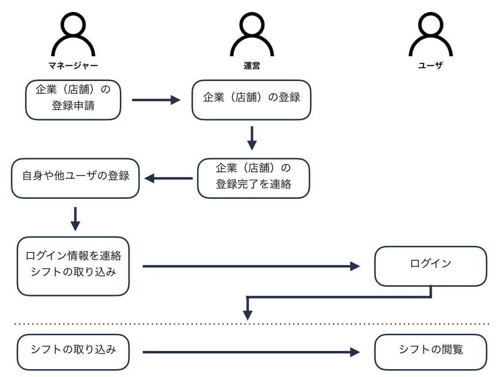

ParJob（パルジョブ）
====

## 概要
シフト表のPDFファイルを取り込んで、月給の計算やシフトを1日単位で簡単に見ることができます。
このParjobは、以前に作成した[まさもん](https://github.com/kentaiwami/masamon)を一新したものです。

以前に作成した[まさもん](https://github.com/kentaiwami/masamon)と異なる点
- UIを一新
- より正確なシフトの取り込み
- 取り込んだシフトや間違って認識したシフトの修正を容易に

## 注意事項
- 事前に登録されている企業(店舗)のみ利用することができます。新規に利用する場合は、ご連絡をいただく必要があります。
- デモユーザでは利用できる機能が一部制限されます。
- デモユーザでシフトを取り込んだ場合、ダミーのシフト情報がランダムに生成されます。

## デモユーザ
```
権限:			admin
企業コード:		3868898
ユーザコード:		9147688
ユーザ名:		aさんM
パスワード:		1234567
```
###### 変更可能な項目
- シフトカテゴリ
- シフト
- 通知
- 時給
- カラー

```
権限:			general
企業コード:		3868898
ユーザコード:		7749812
ユーザ名:		dさん
パスワード:		1234567
```

###### 変更可能な項目
- 通知
- 時給
- カラー

デモユーザでは、下記項目の変更をすることはできません。
- ユーザ名
- パスワード
- ユーザリスト


## 利用フロー


## デモ

